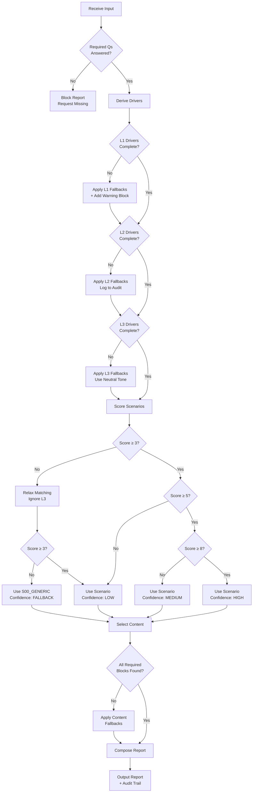

# Fallback Matrix Specification

## Overview

The Fallback Matrix defines how the system handles missing, incomplete, or ambiguous driver data. It ensures every report can be generated even when input is imperfect.

---

## 1. Fallback Trigger Conditions

| Condition | Description | Fallback Level |
|-----------|-------------|----------------|
| **Missing Answer** | Question was skipped or not answered | Level 1 |
| **Ambiguous Answer** | Answer maps to multiple conflicting tags | Level 2 |
| **Invalid Answer** | Answer doesn't match expected options | Level 1 |
| **Conflicting Drivers** | Two drivers have incompatible values | Level 3 |
| **No Scenario Match** | No scenario scores above threshold | Level 4 |
| **Missing Content** | Required content block not found | Level 5 |

---

## 2. Driver Fallback Hierarchy

Each driver has a defined fallback chain when its value cannot be determined.

### Layer 1: Safety Drivers (Critical)

| Driver | Fallback Value | Rationale |
|--------|---------------|-----------|
| `clinical_priority` | `"unknown"` → treat as `"semi_urgent"` | Err on side of caution |
| `biological_stability` | `"unknown"` → treat as `"unstable"` | Safety-first |
| `mouth_situation` | `"unknown"` → `"complex"` | Avoid oversimplification |
| `age_stage` | `"unknown"` → `"adult"` | Most common case |
| `medical_constraints` | `"unknown"` → `"possible_constraints"` | Flag for review |
| `treatment_viability` | `"unknown"` → `"conditional"` | Require professional assessment |
| `risk_profile_biological` | `"unknown"` → `"elevated"` | Conservative assumption |

**L1 Rule**: Missing L1 drivers trigger `A_WARN_INCOMPLETE_ASSESSMENT` block.

### Layer 2: Personalization Drivers

| Driver | Fallback Value | Rationale |
|--------|---------------|-----------|
| `profile_type` | `"unknown"` → `"informed_explorer"` | Neutral middle ground |
| `aesthetic_tolerance` | `"unknown"` → `"moderate"` | Avoid extremes |
| `expectation_risk` | `"unknown"` → `"moderate"` | Middle ground |
| `experience_history` | `"unknown"` → `"no_history"` | Assume first time |
| `decision_stage` | `"unknown"` → `"exploring"` | Safe assumption |
| `autonomy_level` | `"unknown"` → `"balanced"` | Respect autonomy |

**L2 Rule**: Missing L2 drivers use fallback values silently but log to audit.

### Layer 3: Narrative Drivers

| Driver | Fallback Value | Rationale |
|--------|---------------|-----------|
| `anxiety_level` | `"unknown"` → `"mild"` | Empathic default |
| `information_depth` | `"unknown"` → `"standard"` | Balanced detail |
| `budget_type` | `"unknown"` → omit cost section | Don't assume |
| `treatment_philosophy` | `"unknown"` → `"balanced"` | Neutral framing |
| `time_horizon` | `"unknown"` → omit timeline language | Don't assume |

**L3 Rule**: Missing L3 drivers result in neutral tone and omitted optional sections.

---

## 3. Question-Level Fallback Rules

### 3.1 Mapping of Questions to Fallback Behavior

| Question | If Missing | Affected Drivers | Fallback Action |
|----------|-----------|------------------|-----------------|
| Q1 (Current Symptoms) | Required | `clinical_priority` | Block report, request answer |
| Q2 (Tooth Situation) | Required | `mouth_situation` | Block report, request answer |
| Q3 (Medical Conditions) | Fallback | `medical_constraints` | Assume `possible_constraints` |
| Q4 (Medications) | Fallback | `medical_constraints` | Assume `possible_constraints` |
| Q5 (Previous Treatment) | Fallback | `experience_history` | Assume `no_history` |
| Q6 (Satisfaction) | Fallback | `expectation_risk` | Assume `moderate` |
| Q7 (Bone/Gum Health) | Fallback | `biological_stability` | Assume `unstable` (conservative) |
| Q8 (Smoking/Lifestyle) | Fallback | `risk_profile_biological` | Assume `elevated` |
| Q9 (Age) | Fallback | `age_stage` | Assume `adult` |
| Q10 (Aesthetic Priority) | Fallback | `aesthetic_tolerance` | Assume `moderate` |
| Q11 (Budget Range) | Fallback | `budget_type` | Omit cost section |
| Q12 (Timeline) | Fallback | `time_horizon` | Omit timeline language |
| Q13 (Anxiety Level) | Fallback | `anxiety_level` | Assume `mild` |
| Q14 (Info Preference) | Fallback | `information_depth` | Assume `standard` |
| Q15 (Decision Stage) | Fallback | `decision_stage` | Assume `exploring` |
| Q16 (Autonomy Preference) | Fallback | `autonomy_level` | Assume `balanced` |
| Q17 (Philosophy) | Fallback | `treatment_philosophy` | Assume `balanced` |
| Q18 (Concerns) | Optional | Multiple | No fallback needed |

### 3.2 Required vs Optional Questions

```typescript
const QUESTION_REQUIREMENTS: Record<QuestionId, "required" | "fallback" | "optional"> = {
  Q1: "required",   // Must have symptom info
  Q2: "required",   // Must know tooth situation
  Q3: "fallback",
  Q4: "fallback",
  Q5: "fallback",
  Q6: "fallback",
  Q7: "fallback",
  Q8: "fallback",
  Q9: "fallback",
  Q10: "fallback",
  Q11: "fallback",
  Q12: "fallback",
  Q13: "fallback",
  Q14: "fallback",
  Q15: "fallback",
  Q16: "fallback",
  Q17: "fallback",
  Q18: "optional"
};
```

---

## 4. Scenario Matching Fallback

### 4.1 Score Threshold Rules

| Scenario Score | Confidence | Action |
|---------------|------------|--------|
| ≥ 8 | HIGH | Use matched scenario |
| 5-7 | MEDIUM | Use scenario + add uncertainty language |
| 3-4 | LOW | Use scenario + flag for review |
| < 3 | NONE | Trigger fallback scenario |

### 4.2 No-Match Fallback Cascade

When no scenario scores above threshold:

```
Step 1: Try relaxed matching (ignore L3 drivers)
        → If match found: use with MEDIUM confidence

Step 2: Try archetype matching (L1 + L2 only)
        → If match found: use with LOW confidence + flag

Step 3: Use Fallback Scenario (S00_GENERIC)
        → Always available, never fails
        → Confidence: FALLBACK
        → Adds disclaimer about generic content
```

### 4.3 Fallback Scenario Definition

```typescript
const FALLBACK_SCENARIO: ScenarioProfile = {
  id: "S00_GENERIC",
  name: "Generic Assessment",
  description: "Used when no specific scenario matches",

  required_drivers: {},  // No requirements
  strong_drivers: {},
  supporting_drivers: {},
  excluding_drivers: {},

  content_blocks: [
    "B_CTX_GENERAL",
    "B_INTERP_GENERIC",
    "B_RISKLANG_STANDARD"
  ],

  excluded_sections: [5, 6, 7, 8, 9],  // No options, comparison, trade-offs, process, costs

  mandatory_disclaimers: [
    "A_DISCLAIMER_GENERIC_REPORT",
    "A_DISCLAIMER_CONSULT_REQUIRED"
  ]
};
```

---

## 5. Content Block Fallback

### 5.1 Missing Block Resolution

| Block Type | If Missing | Fallback |
|------------|-----------|----------|
| A_* (Safety) | Critical | Use `A_GENERIC_WARNING` |
| B_CTX_* | Important | Use `B_CTX_GENERAL` |
| B_INTERP_* | Important | Use `B_INTERP_GENERIC` |
| B_OPT_* | Optional | Omit section entirely |
| B_COMPARE_* | Optional | Omit section entirely |
| B_TRADEOFF_* | Optional | Omit section entirely |
| B_PROCESS_* | Optional | Omit section entirely |
| B_RISKLANG_* | Required | Use `B_RISKLANG_STANDARD` |
| TM_* (Modules) | Optional | Omit module |

### 5.2 Tone Variant Fallback

If specific tone variant is missing:

```
Requested: TP-04
Fallback chain: TP-04 → TP-02 → TP-01

Requested: TP-05
Fallback chain: TP-05 → TP-03 → TP-01

Requested: TP-02
Fallback chain: TP-02 → TP-01

Requested: TP-03
Fallback chain: TP-03 → TP-01

TP-01 and TP-06: No fallback (must exist)
```

---

## 6. Conflict Resolution

### 6.1 Driver Conflict Matrix

When two drivers have conflicting implications:

| Driver A | Driver B | Conflict | Resolution |
|----------|----------|----------|------------|
| `clinical_priority=urgent` | `decision_stage=decided` | Patient decided but needs urgent care | L1 wins: treat as urgent |
| `anxiety_level=severe` | `information_depth=detailed` | Anxious but wants detail | Use TP-04 tone with full detail |
| `autonomy_level=autonomous` | `treatment_viability=contraindicated` | Wants independence but treatment blocked | L1 wins: block options, explain why |
| `budget_type=limited` | `aesthetic_tolerance=low` | Cost-conscious but high aesthetic needs | Flag conflict, present both perspectives |
| `experience_history=negative` | `decision_stage=decided` | Bad past but already decided | Use TP-05, respect decision |

### 6.2 Conflict Resolution Algorithm

```typescript
function resolveDriverConflict(
  driverA: DriverValue,
  driverB: DriverValue
): ConflictResolution {

  // Rule 1: Layer hierarchy (L1 > L2 > L3)
  if (driverA.layer < driverB.layer) {
    return {
      winner: driverA,
      action: "override",
      log_reason: `L${driverA.layer} overrides L${driverB.layer}`
    };
  }

  // Rule 2: Safety always wins within same layer
  if (driverA.safety_critical && !driverB.safety_critical) {
    return {
      winner: driverA,
      action: "override",
      log_reason: "Safety-critical driver takes precedence"
    };
  }

  // Rule 3: Conservative choice when equal priority
  return {
    winner: selectMoreConservative(driverA, driverB),
    action: "merge",
    log_reason: "Equal priority, conservative selection",
    flag_for_review: true
  };
}
```

---

## 7. Fallback Audit Trail

Every fallback action is logged:

```typescript
interface FallbackEvent {
  timestamp: string;
  session_id: string;

  trigger: {
    type: "missing_answer" | "ambiguous" | "invalid" | "conflict" | "no_match" | "missing_content";
    source: string;  // Question ID, Driver ID, or Content ID
    original_value?: string;
  };

  resolution: {
    fallback_value: string;
    fallback_level: 1 | 2 | 3 | 4 | 5;
    confidence_impact: "none" | "reduced" | "low" | "fallback";
    sections_affected: number[];
  };

  flags: {
    requires_review: boolean;
    disclaimer_added: boolean;
    content_omitted: string[];
  };
}
```

---

## 8. Fallback Indicators in Report

### 8.1 Confidence Badges

Reports include confidence indicator:

| Confidence | Badge | Meaning |
|------------|-------|---------|
| HIGH | None shown | Full data, clear match |
| MEDIUM | "Based on available information" | Some fallbacks used |
| LOW | "Preliminary assessment" | Significant gaps |
| FALLBACK | "General information only" | Generic fallback used |

### 8.2 Uncertainty Language Injection

When fallbacks are used, inject appropriate language:

```typescript
const UNCERTAINTY_PHRASES: Record<ConfidenceLevel, string[]> = {
  HIGH: [],  // No uncertainty language

  MEDIUM: [
    "Based on the information provided...",
    "From what you've shared..."
  ],

  LOW: [
    "With the limited information available...",
    "A more complete picture would require..."
  ],

  FALLBACK: [
    "This general overview is based on typical situations...",
    "Your specific circumstances may differ significantly..."
  ]
};
```

---

## 9. Fallback Decision Tree



---

## 10. Implementation Checklist

- [ ] Define `A_WARN_INCOMPLETE_ASSESSMENT` block
- [ ] Define `A_DISCLAIMER_GENERIC_REPORT` block
- [ ] Define `A_DISCLAIMER_CONSULT_REQUIRED` block
- [ ] Define `B_CTX_GENERAL` fallback block
- [ ] Define `B_INTERP_GENERIC` fallback block
- [ ] Create `S00_GENERIC` scenario with all 6 tones
- [ ] Implement fallback logging to audit store
- [ ] Add confidence badges to report template
- [ ] Create uncertainty phrase injection logic
- [ ] Test all fallback paths with edge cases
