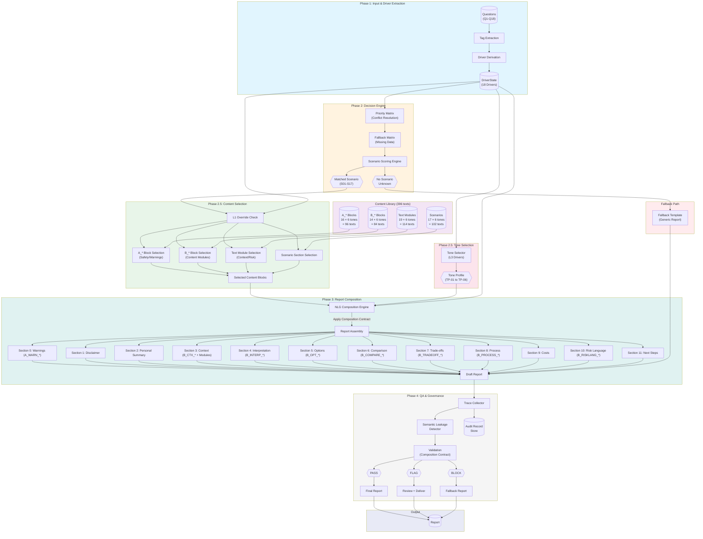
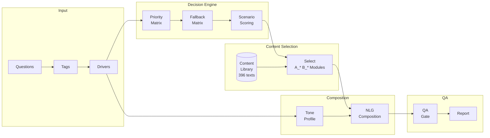
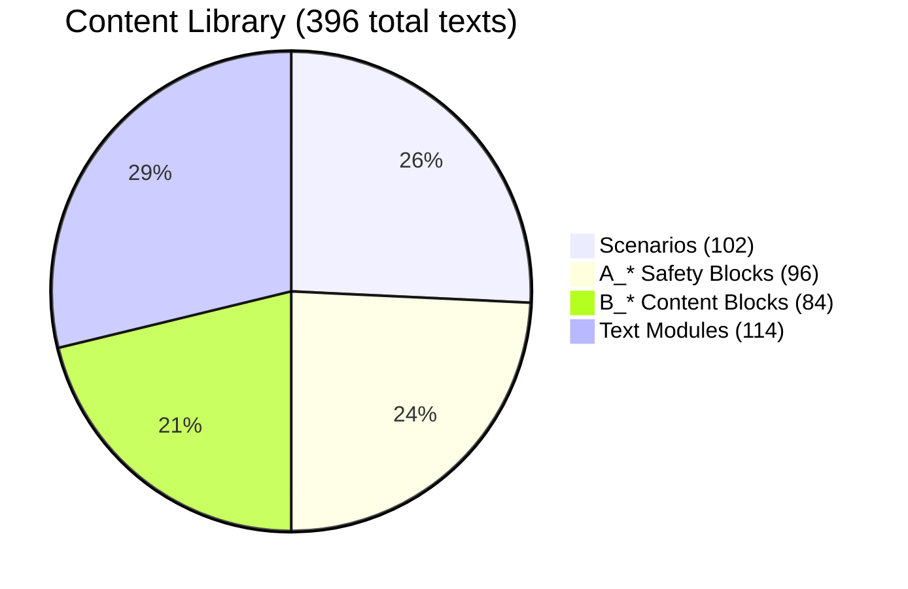
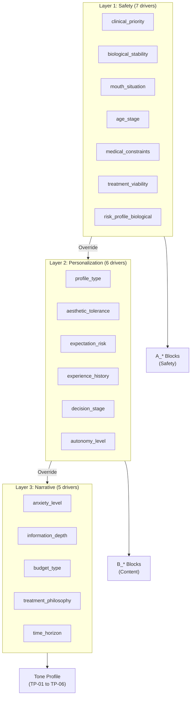
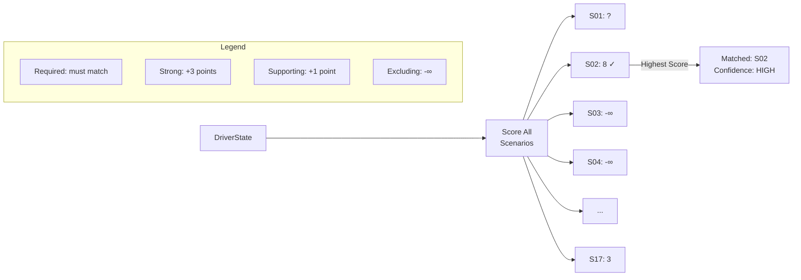
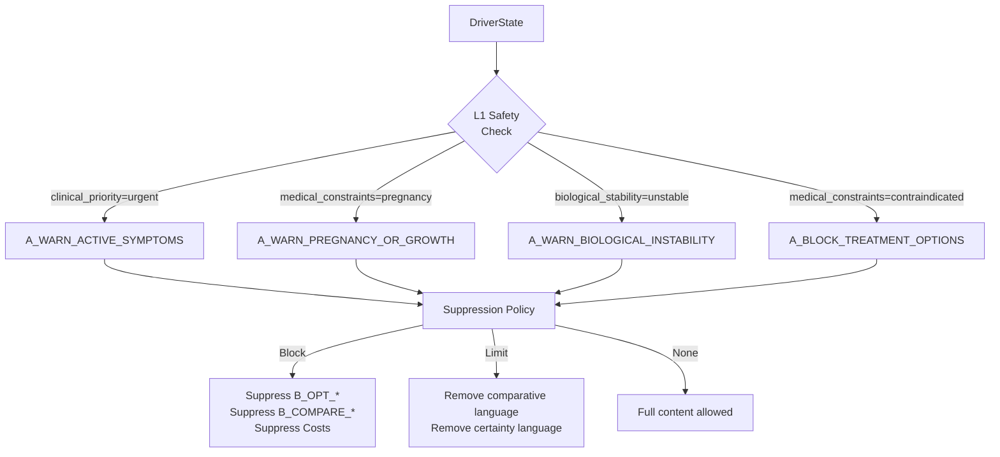
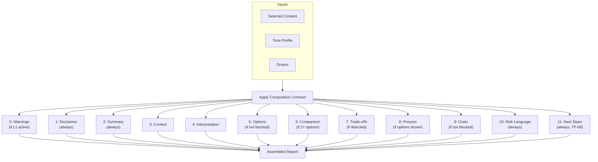
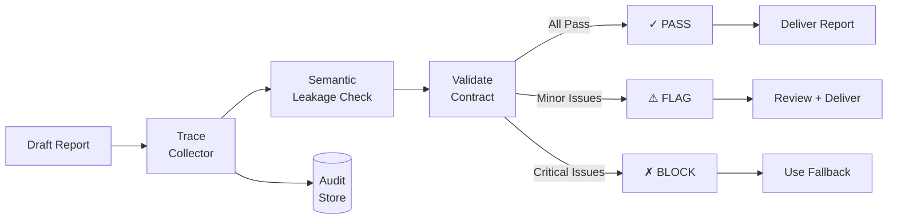

# Smile-Link NLG Report Generation System
## Architecture Diagram

---

## Simplified View

---

## Content Library Breakdown

---

## Driver Layers

---

## Scenario Scoring Flow

---

## L1 Override Logic

---

## Report Composition Flow

---

## QA Gate

